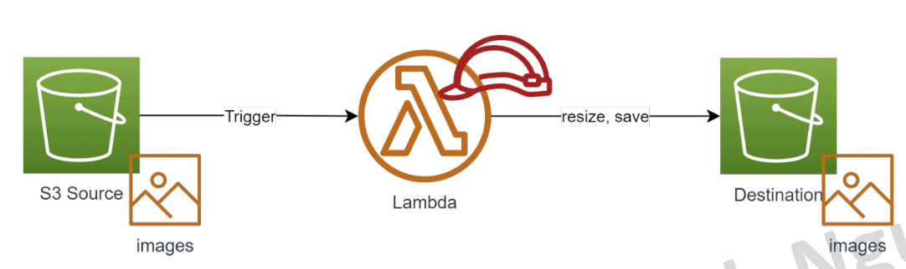
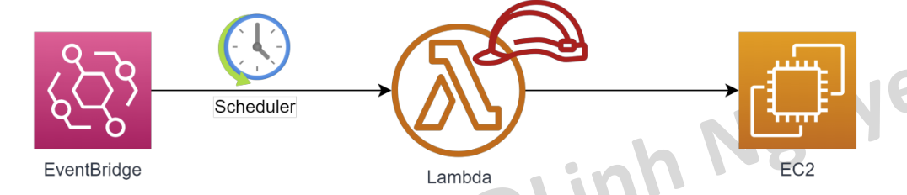
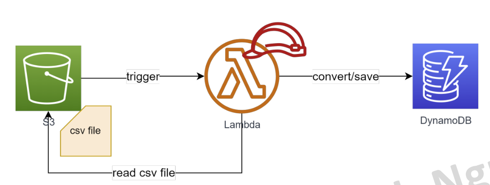

# 13 _ Lambda và những điều cần biết
Hôm nay mình sẽ cùng tìm hiểu về dịch vụ serverless trên AWS là Lambda

## What is Lambda?
Một service serverless của AWS cho phép người dùng thực thi code mà không cần quan tâm tới hạ tầng phía sau.
Lamda hỗ trợ các ngôn ngữ (runtime) sau: 
* Java
* Python 
* .NET
* GO
* Ruby
* Custom Runtime 

## Đặc trưng của Lambda
* Khi tạo 1 lambda function, bạn quyết định cấu hình thông qua thông số Memory. Min = 128MB, Max = 10GB. Memory càng cao, CPU được allocate càng lớn.
* Lambda khi khởi chạy được cấp phát 1 vùng nhớ tạm min = 512MB max =10GB, sẽ bị xoá khi lambda thực thi xong.
* Timeout tối đa 15 phút (quá thời gian này nếu execute chưa xong vẫn tính là failed và bị thu hồi resource).
* Lambda có thể được trigger từ nhiều nguồn: Trigger trực tiếp (Console or CLI), API Gateway, event từ các service khác (S3, SQS, DynamoDB, Kinesis, IoT...), hoặc chạy theo lịch (trigger từ EventBridge).

* Lambda có 2 mode chạy là chạy ngoài VPC và chạy trong VPC. Thông thường nếu lambda cần kết nối với RDS Database thì nên để trong VPC. *Lưu ý đến số lượng IP của subnet chứa lambda.
* Lambda sau khi chạy xong sẽ không lưu lại bất cứ gì
	- Log -> CloudWatch log
	- File output -> S3 hoặc EFS
	- Data output -> RDS Database hoặc DynamoDB.
* Lambda cũng cần được cấp IAM Role để có thể tương tác với các resource khác. Mặc định Lambda khi tạo ra sẽ được gán Role có các quyền cơ bản (vd write log to CloudWatch).

* Lambda không chỉ chứa 1 file code mà có thể chứa các file library, file common,... Để tiện dụng ta có thể gom nhóm chúng lại thành các **layer** và tái sử dụng ở nhiều function, tránh duplicate code.
* Khi có nhiều request từ client, Lambda scale horizontal bằng cách gia tăng số lượng concurent execute. Giới hạn này mặc định khi tạo account AWS là **10 concurent executions**. Cần request tăng số này lên trước khi release production.
* Lambda có thể được set một số **reserve concurent** để tránh bị ảnh hưởng bởi các lambda khác.

## Lambda Pricing
Lambda là một dịch vụ có idle cost = 0. Người dùng chỉ trả tiền cho chi phí chạy thực tế, cụ thể:
* Thời gian execute của lambda. Đơn vị GB * second 
	- VD Singapore price: $0,0000167/GB*second
* $0.2 / 1 millions requests
	- VD: bạn có 1 lambda 512Mb memory, mỗi request chạy trong 5s, 1 tháng có 100,000 requests 
		- 250,000 GB*second = $4.175
		- (250,000/1,000,000)*0.2 = $0.05
		- => Total: $4.225

## Lambda và khả năng ngoại giao ^^
Lambda là một service có thể liên kết với gần như tất cả các service khác của AWS, miễn là nó được cấp IAM Role phù hợp.

## Ưu điểm
- Không tốn effort cho quản trị hạ tầng, High Availablity.
- Zero idle cost. Do lambda chỉ phát sinh chi phí khi chạy, nếu hệ thống
không phát sinh nhu cầu sử dụng -> cost gần như zero.
- Kết hợp được với nhiều service của AWS.
- Khả năng scale mạnh mẽ (bằng cách nhân bản số lượng concurrent).
- Support nhiều ngôn ngữ.
- Dễ dàng triển khai bằng nhiều tool do AWS phát hành hoặc 3rd party.

## Nhược điểm
- Cold start: Code cần thời gian để nạp lên memory trước khi thực sự bắt đầu chạy. *Gần đây AWS đã cải thiện được vấn đề này rất nhiều.
- Giới hạn về bộ nhớ: 10GB. Không phù hợp cho các tác vụ nặng.
- Khó tích hợp. Hệ thống để deploy lên lambda cần chia nhỏ do đó làm
tăng tính phức tạp và khó debug.
- Giới hạn về thời gian chạy, max 15min. Không phù hợp với các tác vụ tính toán tốn thời gian.
- Không lưu lại trạng thái sau khi chạy. Cần có external storage, database, logging.

## Khi nào nên sử dụng Lambda?
Do những ưu điểm kể trên, Lambda phù hợp cho những usecase
- Tác vụ automation trên AWS, nhận trigger từ các AWS service như S3, DynamoDB, SNS, SQS,...
- Backend cho API hoặc IoT.
- Xử lý data trong bài toán data ETL.
- Hệ thống có kiến trúc microservice nói chung.
- Công ty start up muốn tối ưu cost cho giai đoạn đầu.

## Khi nào KHÔNG nên sử dụng Lambda?
Do những hạn chế kể trên, Lambda Không phù hợp cho những usecase
- Hệ thống Monolithic (do souce code quá nặng) hoặc team không có kinh nghiệm phát triển hệ thống microservice.
- Xử lý dữ liệu lớn, phân tích, tổng hợp data (hoặc chạy nhiều hơn 15p). 
- Machine Learning.

# Các usecase thường sử dụng Lambda
- Dùng làm backend API khi kết hợp với API Gateway
- Thực hiện các tác vụ đơn giản theo lịch kết hợp với EventBridge
- Xử lý async khi nhận trigger từ S3
- Xử lý async khi nhận trigger từ DynamoDB
- Sử dụng trong bài toán ETL khi kết hợp với Kinesis, IoT

## LAB
### Lab 1 – Xử lý file được upload lên S3 tự động
Yêu cầu: Tạo 1 lambda có chức năng xử lý hình (.jpg, .png) được upload lên S3 thành các size khác nhau, output được lưu vào thư mục tương ứng.
Sơ đồ hệ thống:

Steps:
1. Tạo một Lambda Layer sử dụng zip file được cung cấp. *Vì tác vụ xử lý ảnh đòi hỏi phải có một thư viện thêm vào.
2. Tạo một lambda python theo mẫu, add layer đã tạo ở step1.
3. Cấu hình IAM Role cho lambda, add thêm policy S3FullAccess.
4. Setting trigger từ S3 cho thư mục /images. (Một lưu ý nhỏ là Lambda và S3 phải cùng Region)
5. Thử upload một file định dạng .jpg
6. Kiểm tra log của lambda.
7. Kiểm tra xem các file resized có được tạo ra và lưu vào thư mục tương ứng.

*Trong bài Lab 1 có sử dụng lambda layer từ Github repository sau:
https://github.com/keithrozario/Klayers
Các bạn có thể tham khảo (lưu ý license)

### Lab 2 – Bật tắt EC2 instance theo lịch
Yêu cầu: Tạo 1 lambda có chức năng bật tắt EC2 instance theo lịch. Lambda nhận 2 tham số là “instance_id” và “action” (START, STOP). Tiến hành setting schedule cho lambda sử dụng EventBridge. Khi triger lambda, EventBridge sẽ truyền sang 2 tham số cần thiết.

Steps:
- Tạo một EC2 instance Linux.
- Tạo một Lambda Function (python) với code mẫu.
- Cấp quyền EC2StartInstance/ EC2StopInstance cho Lambda.
- Setting một EventBridge event với lịch gần với thời gian hiện tại, trong event truyền tham số **{action: STOP, instance_id: <instance id muốn stop>}**
- Đợi đến thời gian đã set, xem lambda có được trigger, EC2 có được stop
- Thực hiện tương tự cho hành động start instance.
**{action: START, instance_id: <instance id muốn start>}**
AWS Cloud for beginner

### Lab3: Xử lý data CSV lưu vào DynamoDB
Yêu cầu: Tạo 1 lambda có chức năng nhận notification từ S3 khi có một file csv được upload. Lambda đọc file csv và lưu vào DynamoDB table tương ứng.

Steps:
1. Tạo table employee trong DynamoDB như sample.
2. Tạo một file csv theo sample.
3. Tạo lambda sử dụng code mẫu
4. Config lại Memory và timeout (vd 512 MB, 2min)
5. Cấu hình Lambda, cấp S3FullAccess & DynamoDBFullAccess permission
6. Cấu hình trigger từ S3 sang Lambda
7. Test upload một file csv lên S3.
8. Xem Log của Lambda function.
9. Xem kết quả data lưu vào DynamoDB Table.

### Lab: Clear resources
Login to AWS console, thực hiện nội dung sau:
1. *Lambda là một resource có zero idle cost nên các bạn hoàn toàn có thể giữ lại phục vụ tham khảo.
2. Các file nặng có thể xoá khỏi S3 để tiết kiệm chi phí.
3. Xóa toàn bộ DynamoDB Table.
4. Terminate EC2 instance.
5. Xoá snapshot còn sót lại.
6. Xoá Elastic Ip (nếu có).