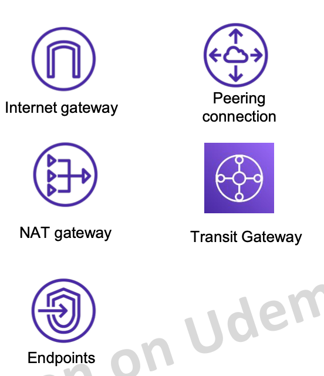

# 14 Virtual Private Cloud (VPC)

## Khái niệm chung
What is VPC?
Viêt tắt của Virtual Private Cloud
- Là một service cho phép người dùng tạo một mạng ảo (virtual network) và control toàn bộ network in/out của mạng đó.
- VPC tương đối giống với network ở datacenter truyền thống tuy nhiên các khái niệm đã được AWS đơn giản hoá giúp người dùng dễ tiếp cận.
### Các thành phần cơ bản của VPC
- VPC: Một mạng ảo được tạo ra ở cấp độ region.
-  Subnet: Một dải IP được định nghĩa nằm trong VPC. Mỗi subnet phải được quyết định Availability Zone tại thời điểm tạo ra.
- IP Address: IP V4 hoặc V6 được cấp phát. Có 2 loại là Public IP và Private IP.
- Routing: xác định traffic sẽ được điều hướng đi đâu trong mạng.
- Elastic IP: IP được cấp phát riêng, có thể access từ internet (public), không bị thu hồi khi instance start -> stop.
Router
Elastic IP address

- Security Group: Đóng vai trò như một firewall ở cấp độ instance, định nghĩa traffic được đi vào /đi ra. *Đã học ở bài EC2.
- Network Access Controll List (ACL): được apply ở cấp độ subnet, tương tự như security group nhưng có rule Deny và các rule được đánh độ ưu tiên. Mặc định khi tạo VPC sẽ có 1 ACL được apply cho toàn bộ subnet trong VPC (mở all traffic không chặn gì cả).

- VPC Flow Log: capture các thông tin di chuyển của traffic trong network.
- VPN Connection: kết nối VPC trên AWS với hệ thống dưới On-premise.
- Elastic Network Interface: đóng vai trò như 1 card mạng ảo.
- Internet Gateway: Kết nối VPC với Internet, là cổng vào từ internet tới các thành phần trong VPC.
- NAT Gateway: dịch vụ NAT của AWS cho phép các thành phần bên trong kết nối tới internet nhưng không cho bên ngoài kết nối tới.
- VPC Endpoint: kênh kết nối private giúp kết nối tới các services khác của AWS mà không thông qua internet.
- Peering connection: kênh kết nối giữa 2 VPC.
- Transit gateways: đóng vai trò như 1 hub đứng giữa
các VPCs, VPN Connection, Direct Connect.

-----
### khó quá để hôm khác back lại

Xem lần 2 có vẻ dể hơn rồi, nhưng cũng chưa xem hết.

Hiểu được tôgnr quan về VPC để không chế traffic của 1 hệ thống.

Cái này đúng là quan trọng thật