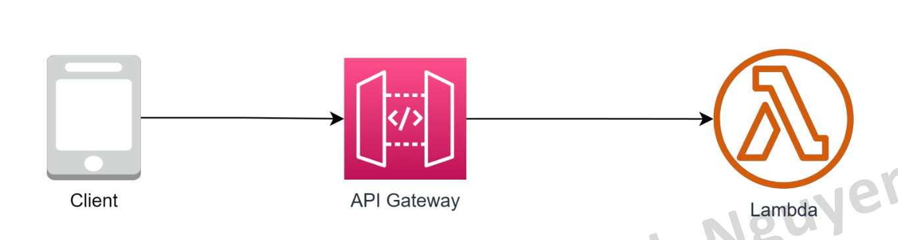

# API Gateway & Cognito

# 1. API Gateway
## API Gateway là gì?
Một dịch vụ API Gateway được cung cấp bởi AWS. Nó cung cấp một cách đơn giản để xây dựng, quản lý và bảo mật các RESTful API hoặc WebSocket. AWS API Gateway là một dịch vụ quan trọng trong kiến trúc dựa trên các dịch vụ của AWS (AWS-based microservices architecture) và thường được sử dụng cùng với các dịch vụ AWS khác như AWS Lambda, EC2, S3, Amazon DynamoDB.

## API Gateway là gì?
AWS API Gateway cung cấp các tính năng:
- Cho phép thiết kế và phát triển API RESTful hoặc WebSocket thông qua web GUI.
- Điều phối các yêu cầu API đến các hệ thống hoặc dịch vụ khác nhau.
- Authen/Author request tới các API.
- Quản lý và giám sát các yêu cầu API, vd số lượng request,
response time...
- AWS API Gateway cũng cung cấp các tính năng bảo mật, bao gồm chứng thực và ủy quyền các yêu cầu API và mã hóa secure communication giữa các hệ thống khác nhau.

## Đặc trưng của API Gateway
- Là một fully managed service của AWS.
- Khả năng scale và High Availablity không giới hạn.
- Zero idle cost
- Easy to setup
- Dễ dàng kết hợp với các dịch vụ khác như CloudWatch, WAF cho mục đích monitor & security.

## Hệ sinh thái API Gateway
API Gateway là một service chủ yếu có nhiệm vụ nhận request của client sau đó forward tới các service phía sau.

## Khi nào nên sử dụng API Gateway?
API Gateway phù hợp cho những bài toán sau
- Kiến trúc Micro-service sử dụng lambda làm backend
- Backend API cho hầu hết các use case (web API, IoT)
- Gateway nhận data trực tiếp từ client sau đó lưu vào DynamoDB (DB First) 
- Web Socket cho những hệ thống realtime communication.

## Authentication cho API Gateway
API Gateway cung cấp 2 phương thức authen tích hợp trực tiếp (authorizer) thường được sử dụng đó là:
• Cognito Authorizer
Liên kết trực tiếp với một Cognito User Pool sử dụng làm authorizer. Khi access API, client passing trực tiếp token lấy được thông qua login với Cognito, API Gateway sẽ check token và allow access nếu token hợp lệ.
• Lambda Authorizer (custom authorizer)
Khi sử dụng loại authorizer này, bạn sẽ tự implement logic authen trên Lambda. Có 2 hình thức là authen dựa vào TOKEN (JWT) hoặc request parameter based (VD username/password).

## Thực hành
Lab 1 – API Gateway + lambda backend
Yêu cầu: Tạo 1 API Gateway có chức năng nhận request từ client, forward tới Lambda backend xử lý sau đó response.

Lab 1 – API Gateway + lambda backend
Steps:
1. Tạo một Lambda function với code mẫu (Python)
2. Tạo một API Gateway
3. Tạo resource & path vd /calculate method POST, forward sang lambda
4. Deploy API Gateway thành một stage vd dev
5. Sử dụng Postman để test API

# 2. Cognito
## Cognito là gì?
AWS Cognito là một dịch vụ quản lý **danh tính** và **xác thực** người dùng của Amazon Web Services (AWS). Dịch vụ này cho phép bạn tạo ra các ứng dụng web và di động an toàn với khả năng xác thực người dùng, phân quyền, và đăng nhập với nhiều tùy chọn như user account, Social login hoặc đăng nhập qua Identity Provider.

## Tính năng của Cognito
Tính năng cơ bản của Cognito
• Đăng ký & Xác thực người dùng sd username/pw/email hoặc tài khoản mạng xã hội.
• Phân quyền người dùng vào các ứng dụng hoặc tài nguyên
• Xác thực email/số điện thoại.
• Tích hợp với các dịch vụ khác (API Gateway, Lambda) để xây dựng ứng dụng.
• Hỗ trợ cho ứng dụng di động (iOS,Android) thông qua SDK
• Cognito sync: sync data giữa các mobile device với nhau
• Advanced Security: giám sát & phân tích truy cập của user để phát hiện và ngăn chặn truy cập bất thường (optional).

## Lab 4- Combine Cognito with API Gateway
Sơ đồ hệ thống

### Clear resources
Trên AWS console, thực hiện các steps sau:
1. Lambda có Idle cost = 0, có thể xoá hoặc giữ lại để tham khảo.
2. API Gateway có Idle cost = 0, có thể xoá hoặc giữ lại để tham khảo.
3. Cognito User pool: Có thể giữ lại tham khảo do vẫn nằm trong free tier.